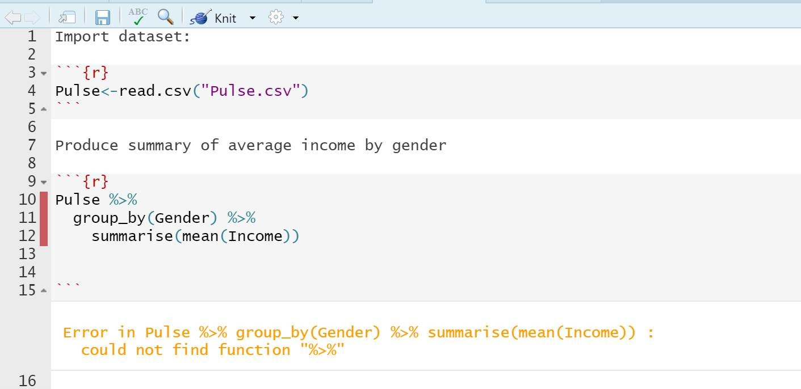
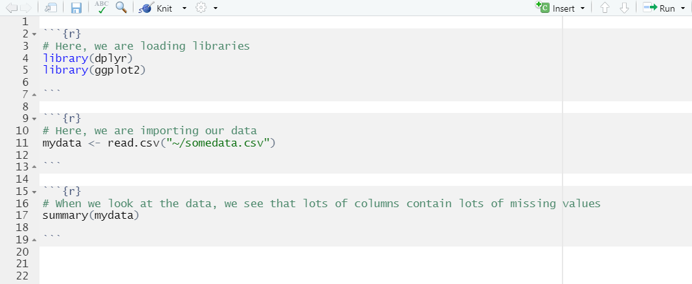

## Quiz

*Question 1*

<!--html_preserve-->

<!--/html_preserve-->

*Question 2*

<!--html_preserve-->

<!--/html_preserve-->

*Question 3*

<!--html_preserve-->

<!--/html_preserve-->

*Question 4*

<!--html_preserve-->

<!--/html_preserve-->

## Exercises

**Exercise 1: Now that you have imported the Happiness dataset into R – let’s do a quick exercise to recap what we learnt in Modules 1-3, but writing out the code entirely in RStudio instead of online.**

1.	Find the 5 countries with the lowest ‘generosity scores’  
2.	Produce a subset of countries which have below average scores for both GDP and generosity.  
3.	Make a plot showing the relationship between generosity and GDP per capita  
 

**Exercise 2: Download the file below that contains the imdb dataset and the solutions for the module 3 exercises. Save these in your project folder. Import the data using RStudio menu and go through the R Markdown file to reproduce the solution in your own machine**

[Module-3-Data-and-Solutions.zip](https://github.com/stats4sd/r2020_04Quiz/raw/main/Module-3-Data-and-Solutions.zip)

## Appendix: 'Happiness' dataset 

The data used for the questions in this workbook comes from the World Happiness Report 2019. The World Happiness Report is an annual publication of the United Nations Sustainable Development Solutions Network. It aims at ranking 156 countries by level of global happiness of their population, by doing an annual survey on their citizens.

In this dataset, the variables 'GDP per capita','Social support','Healthy life expectancy','Freedom to make life choices','Generosity' and 'Perceptions of corruption' are factors used to compute the Happiness Score ('Score').

The methodology, as well as more information about this publication, can be found <a href="https://worldhappiness.report/ed/2019/" target="_blank">here </a>. 

## Appendix: 'imdb' dataset

For one exercise of this module, we are using a dataset called "imdb", which we constructed from the subsets of the Internet Movie Database made available for non-commercial purposes by the IMDb team:
<a href="https://www.imdb.com/interfaces/" target="_blank">https://www.imdb.com/interfaces/</a>

It contains the following information for all the entries having more than 500 votes, that are not of type "tvEpisodes" and for which information about year of release, running time and director(s) was available at the time of extraction (28/09/2020):  

|Column        |Description                                                                                          |
|:-------------|:----------------------------------------------------------------------------------------------------|
|title         |popular title of the entry                                                                           |
|type          |type of entry: movie, short, tvMiniSeries, tvMovie, tvSeries, tvShort, tvSpecial, video or videoGame |
|year          |year of release (for series, year of release of the first episode)                                   |
|length        |duration in minutes                                                                                  |
|numVotes      |number of votes for the entry                                                                        |
|averageRating |IMDb's weighted average rating for the entry                                                         |
|director      |director of the entry (if multiple directors, the first one was picked)                              |
|birthYear     |year of birth of the director                                                                        |
|animation     |the entry is of genre animation (TRUE/FALSE)                                                         |
|action        |the entry is of genre action (TRUE/FALSE)                                                            |
|adventure     |the entry is of genre adventure (TRUE/FALSE)                                                         |
|comedy        |the entry is of genre comedy (TRUE/FALSE)                                                            |
|documentary   |the entry is of genre documentary (TRUE/FALSE)                                                       |
|fantasy       |the entry is of genre fantasy (TRUE/FALSE)                                                           |
|romance       |the entry is of genre romance (TRUE/FALSE)                                                           |
|sci_fi        |the entry is of genre science fiction (TRUE/FALSE)                                                   |
|thriller      |the entry is of genre thriller (TRUE/FALSE)                                                          |

## Appendix:  Useful reference links  

RStudio website:<a href="https://rstudio.com/" target="_blank">https://rstudio.com/   </a> 

R-project website:<a href="https://www.r-project.org/" target="_blank">https://www.r-project.org/   </a> 

Andy Field's Getting started in R and RStudio:<a href="http://milton-the-cat.rocks/learnr/r/r_getting_started" target="_blank">http://milton-the-cat.rocks/learnr/r/r_getting_started   </a> 

R Markdown documentation:<a href="https://rmarkdown.rstudio.com/lesson-1.html" target="_blank">https://rmarkdown.rstudio.com/lesson-1.html   </a> 

RStudio CheatSheet:<a href="https://rstudio.com/wp-content/uploads/2016/01/rstudio-IDE-cheatsheet.pdf" target="_blank">https://rstudio.com/wp-content/uploads/2016/01/rstudio-IDE-cheatsheet.pdf   </a>

R Markdown CheatSheet:<a href="https://rstudio.com/wp-content/uploads/2015/02/rmarkdown-cheatsheet.pdf" target="_blank">https://rstudio.com/wp-content/uploads/2015/02/rmarkdown-cheatsheet.pdf   </a>

Illustrated presentation of 'tidy data': <a href="https://docs.google.com/presentation/d/1N7hKepabvl9OrHjvGJWPjUsfzVdB5xzV5AsFndgSwms/edit?usp=sharing" target="_blank">Make friends with tidy data </a> 

Video explaining the command to import text files into R - DataCamp:<a href="https://www.youtube.com/watch?v=Yy-ismDUkkQ" target="_blank">https://www.youtube.com/watch?v=Yy-ismDUkkQ   </a> 

Article on the RStudio support site showing how to import data from different files via the RStudio import menu:<a href="https://support.rstudio.com/hc/en-us/articles/218611977-Importing-Data-with-RStudio" target="_blank">Importing Data with RStudio</a> 

RStudio documentation on connecting to databases using R  <a href="https://db.rstudio.com" target="_blank">https://db.rstudio.com </a>

<!--html_preserve-->

<!--/html_preserve-->
<!--html_preserve-->

<!--/html_preserve-->
<!--html_preserve-->

<!--/html_preserve-->
<!--html_preserve-->

<!--/html_preserve-->
<!--html_preserve-->

<!--/html_preserve-->
<!--html_preserve-->

<!--/html_preserve-->
<!--html_preserve-->

<!--/html_preserve-->
